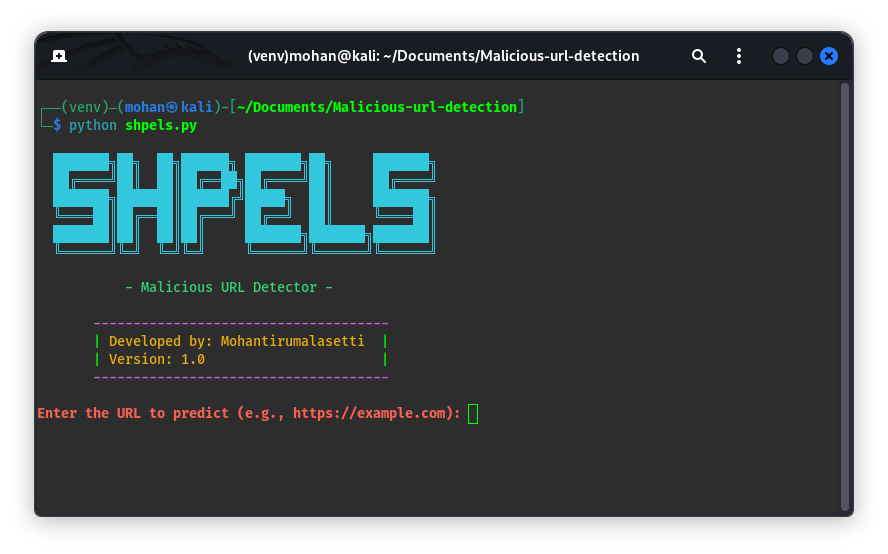

## SHAPELS



---

### Overview

The Malicious URL Detector is a Python tool designed to predict whether a given URL is malicious or not. It utilizes machine learning algorithms trained on a dataset containing various features extracted from URLs to make predictions.

### Background

Research conducted by Rami M. Mohammad, Fadi Thabtah, and Lee McCluskey highlighted the challenges of finding reliable training datasets for predicting phishing websites. Despite numerous articles on the topic, no definitive agreement on the features characterizing phishing websites exists in the literature. Therefore, their research focused on identifying important features and proposing new ones to improve prediction accuracy.

### Features

#### Address Bar-based Features

1. **Using the IP Address**: Detects if an IP address is used instead of a domain name in the URL.
2. **Long URL to Hide the Suspicious Part**: Identifies long URLs used to obfuscate suspicious parts.
3. **Using URL Shortening Services "TinyURL"**: Detects the use of URL shortening services.
4. **URLs having "@" Symbol**: Identifies URLs containing the "@" symbol.
5. **Redirecting using "//"**: Detects redirection using "//" in the URL path.
6. **Adding Prefix or Suffix Separated by (-) to the Domain**: Detects the addition of prefixes or suffixes to the domain name.
7. **Sub Domain and Multi Sub Domains**: Analyzes the presence of subdomains in the URL.
8. **HTTPS (Hyper Text Transfer Protocol with Secure Sockets Layer)**: Checks for the presence of HTTPS and certificate trustworthiness.
9. **Domain Registration Length**: Assesses the length of domain registration.
10. **Favicon**: Checks if the favicon is loaded from an external domain.
11. **Using Non-Standard Port**: Identifies the use of non-standard ports in URLs.
12. **The Existence of "HTTPS" Token in the Domain Part of the URL**: Detects the presence of the "HTTPS" token in the URL domain.

#### Abnormal-based Features

1. **Request URL**: Analyzes the percentage of external objects loaded within a webpage.
2. **URL of Anchor**: Examines the percentage of URL links within anchor tags.
3. **Links in <Meta>, <Script> and <Link> tags**: Checks the percentage of links in specific HTML tags.
4. **Server Form Handler (SFH)**: Identifies suspicious server form handlers.
5. **Submitting Information to Email**: Detects forms submitting user information to email.
6. **Abnormal URL**: Examines the presence of the hostname in the URL.

#### HTML and JavaScript-based Features

1. **Website Forwarding**: Analyzes the number of redirections on a webpage.
2. **Status Bar Customization**: Checks if JavaScript changes the status bar.
3. **Disabling Right Click**: Detects if right-click functionality is disabled.
4. **Using Pop-up Window**: Identifies pop-up windows requesting user information.
5. **IFrame Redirection**: Detects the use of invisible iframes.

#### Domain-based Features

1. **Age of Domain**: Analyzes the age of the domain.
2. **DNS Record**: Checks for DNS records associated with the domain.
3. **Website Traffic**: Measures the popularity of the website.
4. **PageRank**: Determines the PageRank value of the webpage.
5. **Google Index**: Examines whether the website is indexed by Google.
6. **Number of Links Pointing to Page**: Analyzes the number of links pointing to the webpage.
7. **Statistical Reports**: Considers statistical reports from reputable sources.

### Usage

1. Clone the repository:

   ```bash
   git clone https://github.com/your-username/malicious-url-detector.git
   ```

2. Navigate to the project directory:

   ```bash
   cd malicious-url-detector
   ```

3. Set up and activate a virtual environment:

   ```bash
   python3 -m venv venv
   source venv/bin/activate  # On Linux/macOS
   .\venv\Scripts\activate    # On Windows
   ```

4. Install the required dependencies:

   ```bash
   pip install -r requirements.txt
   ```

5. Run the tool and enter the URL you want to predict:

   ```bash
   python malicious_url_detector.py
   ```

### Contributing

Contributions are welcome! If you find any bugs or have suggestions for improvements, please open an issue or create a pull request.

### License

This project is licensed under the MIT License - see the [LICENSE](LICENSE) file for details.

--- 

Feel free to customize this README file according to your project's specific details and requirements. Let me know if you need further assistance!
